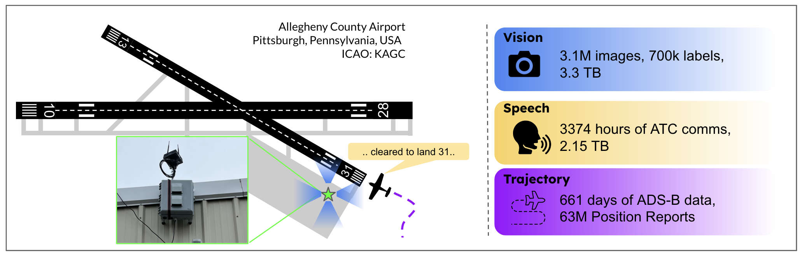

# TartanAviation: Vision, Speech, and ADS-B Trajectory Datasets for Terminal Airspace Operations

[Paper Link](http://arxiv.org/abs/2403.03372) | [Website Link](https://theairlab.org/tartanaviation/)
<p align="center">
  <a href="">
    
  </a>
</p>

This repository contains the scripts and documentation for downloading and analyzing the TartanAviation datasets.

Please refer to the README files in the `vision`, `audio`, and `traj` sub-folders for information regarding the respective modalities.

## Citation

If you find this dataset helpful, please cite the following work:

```
@article{patrikar2024tartanaviation,
	title={TartanAviation: Image, Speech, and ADS-B Trajectory Datasets for Terminal Airspace Operations}, 
	author={Jay Patrikar and Joao Dantas and Brady Moon and Milad Hamidi and Sourish Ghosh and Nikhil Keetha and Ian Higgins and Atharva Chandak and Takashi Yoneyama and Sebastian Scherer},
	year={2024},
	eprint={2403.03372},
	archivePrefix={arXiv},
	primaryClass={cs.LG},
	url={https://arxiv.org/pdf/2403.03372.pdf}
}
```
